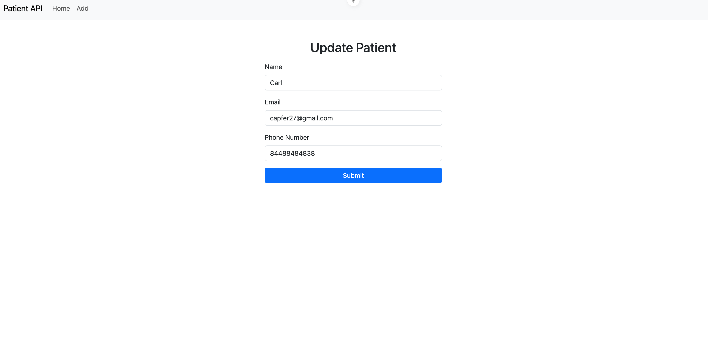
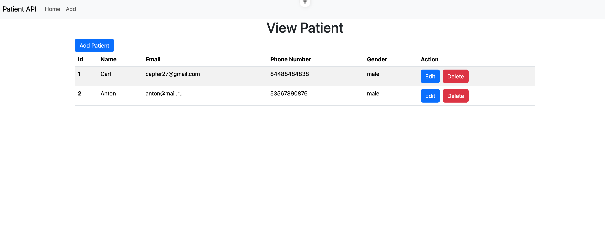

# Simple Spring Boot VUE-JS CRUD APP

🚀 **Project launch (Запуск проекта)**

**Prerequisites (Предварительные требования)**

* JDK 21 || 17+
* Docker 20.10+
* Docker Compose 2.4+
* Gradle 8.14+

**Local launch via Docker Compose (Локальный запуск через Docker Compose)**

1. **Clone the repository (Клонируйте репозиторий)**:
   `git clone https://github.com/capfer27/spring-boot-vuejs-crud-app-2025.git`
2. `docker compose up -d --build`
3. `cd front-vue-crud`
4. `npm run dev`
5. **View the app at the following link (Посмотреть приложение по ссылке):** http://localhost:5173/ 

**Stopping Services (Остановка сервисов):** 
   - `CTRL + C`
   - `cd ../ && docker compose down`

**Screenshots (Скриншоты)**
  
  - 

  - 

  - 
